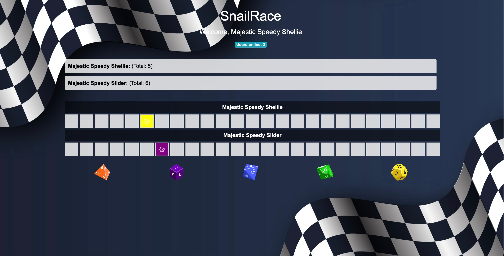

# SnailRace

SnailRace is an interactive web-based game where users can join and race snails by selecting dice images. The game tracks scores and announces a winner with a fun fireworks animation. The project was developed using HTML, CSS, JavaScript, and Socket.io, with the assistance of ChatGPT for generating code snippets and providing guidance throughout the development process.

How This Was Built Using ChatGPT
This project was built with the assistance of ChatGPT, an AI language model developed by OpenAI. ChatGPT provided code snippets, suggested best practices, and guided the development process. The AI helped in structuring the project, writing HTML, CSS, and JavaScript code, and implementing features such as real-time user interaction, grid updates, and the finish screen animation.



--- 
## How to Install

1. ### Clone the Repository:

```bash
git clone https://github.com/yourusername/snailrace.git
cd snailrace
```

2. ### Install Dependencies:
Ensure you have Node.js installed. Then, run:

```bash
npm install
```

3. ### Add Images:
Ensure you have the necessary images in the images folder:

* d4.png
* d6.png
* d8.png
* d10.png
* d12.png
* snail.png
* background.jpg
* favicon.ico

---
## How to Run
1. ### Start the Server:

```bash
Copiar código
node server.js
```

2. ### Access the Game:
Open a web browser and navigate to http://localhost:3000.

---

## How to Play
1. ### Join the Game:
When you connect, a unique snail-related name is assigned to you. Your name is displayed at the top of the page.

2. ### Select a Dice Image:
Choose one of the dice images at the bottom of the page. The number rolled will be a random value between 1 and the maximum value of the selected dice (e.g., 1-4 for d4).

3. ### Move on the Grid:
Your snail moves on the grid based on the number rolled. Each user has a unique row in the grid, and the cell your snail moves to is highlighted.

4. ### Track Scores:
The game keeps track of each user's score. The goal is to reach the maximum score (equal to the number of columns).

5. ### Win the Game:
When a user reaches the maximum score, a finish screen with fireworks will announce the winner. The game then resets for a new round.

---

## Additional Features
1. ### Real-time Interaction:
Users can interact in real-time, with scores and movements updated live for all participants.

2. ### Visual Themes:
The game features a snail race theme with a background image and color-coded cells.

3. ### Animations:
A fireworks animation is displayed when a user wins the game.

4. ### Contributions
Feel free to fork this repository and submit pull requests. Contributions are welcome!

License
This project is licensed under the MIT License.

--- 

Enjoy playing SnailRace and may the fastest snail win! 🐌🏁

